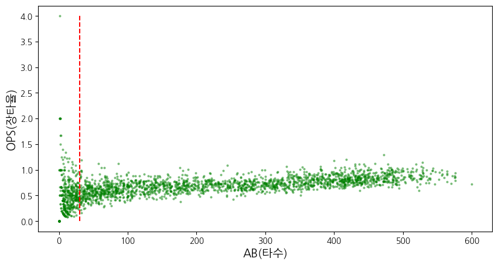
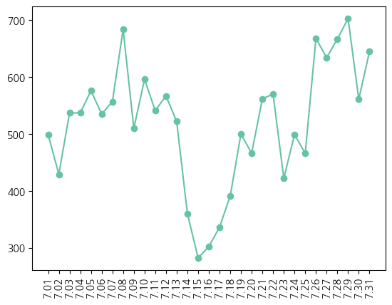

```python
import pandas as pd
import matplotlib.pyplot as plt
import matplotlib
import matplotlib.font_manager as fm
import seaborn as sns
import pandas as pd
from IPython.display import display
import numpy as np


pd.options.display.max_columns = None
%matplotlib inline

# 한글 폰트
plt.rcParams['font.family'] = 'NanumGothic'
# 마이너스 깨짐 방지
matplotlib.rcParams['axes.unicode_minus'] = False

# 나눔 폰트 경로 설정
font_path = '/usr/share/fonts/truetype/nanum/NanumGothic.ttf'  # 나눔 고딕의 경로
font_prop = fm.FontProperties(fname=font_path).get_name()

# 한글 폰트 설정
matplotlib.rcParams['font.family'] = font_prop

# 전역 팔레트 설정 (예: 'Set2' 팔레트 사용)
sns.set_palette('Set2')
sns_color = sns.color_palette('pastel')[0:5]
```


```python
# 데이터 불러오기
regular_season = pd.read_csv('../datas/Regular_Season_Batter.csv')
regular_season_day = pd.read_csv('../datas/Regular_Season_Batter_Day_by_Day_b4.csv')

# 데이터프레임 null 값 확인
display(pd.DataFrame({'regular_season': regular_season.isna().sum(), 'regular_season_day': regular_season_day.isna().sum()}).fillna(''))

'''
앞서 각 데이터의 null 값을 모두 채웠기 때문에 없다.
첫 연봉은 제대로된 정보가 없고, 있더라도 조금씩 달라서 제외했다.
''';
```


<div>
<style scoped>
    .dataframe tbody tr th:only-of-type {
        vertical-align: middle;
    }

    .dataframe tbody tr th {
        vertical-align: top;
    }

    .dataframe thead th {
        text-align: right;
    }
</style>
<table border="1" class="dataframe">
  <thead>
    <tr style="text-align: right;">
      <th></th>
      <th>regular_season</th>
      <th>regular_season_day</th>
    </tr>
  </thead>
  <tbody>
    <tr>
      <th>2B</th>
      <td>0.0</td>
      <td>0.0</td>
    </tr>
    <tr>
      <th>3B</th>
      <td>0.0</td>
      <td>0.0</td>
    </tr>
    <tr>
      <th>AB</th>
      <td>0.0</td>
      <td>0.0</td>
    </tr>
    <tr>
      <th>BB</th>
      <td>0.0</td>
      <td>0.0</td>
    </tr>
    <tr>
      <th>CS</th>
      <td>0.0</td>
      <td>0.0</td>
    </tr>
    <tr>
      <th>E</th>
      <td>0.0</td>
      <td></td>
    </tr>
    <tr>
      <th>G</th>
      <td>0.0</td>
      <td></td>
    </tr>
    <tr>
      <th>GDP</th>
      <td>0.0</td>
      <td>0.0</td>
    </tr>
    <tr>
      <th>H</th>
      <td>0.0</td>
      <td>0.0</td>
    </tr>
    <tr>
      <th>HBP</th>
      <td>0.0</td>
      <td>0.0</td>
    </tr>
    <tr>
      <th>HR</th>
      <td>0.0</td>
      <td>0.0</td>
    </tr>
    <tr>
      <th>OBP</th>
      <td>0.0</td>
      <td></td>
    </tr>
    <tr>
      <th>OPS</th>
      <td>0.0</td>
      <td></td>
    </tr>
    <tr>
      <th>R</th>
      <td>0.0</td>
      <td>0.0</td>
    </tr>
    <tr>
      <th>RBI</th>
      <td>0.0</td>
      <td>0.0</td>
    </tr>
    <tr>
      <th>SB</th>
      <td>0.0</td>
      <td>0.0</td>
    </tr>
    <tr>
      <th>SLG</th>
      <td>0.0</td>
      <td></td>
    </tr>
    <tr>
      <th>SO</th>
      <td>0.0</td>
      <td>0.0</td>
    </tr>
    <tr>
      <th>TB</th>
      <td>0.0</td>
      <td></td>
    </tr>
    <tr>
      <th>avg</th>
      <td>0.0</td>
      <td></td>
    </tr>
    <tr>
      <th>avg1</th>
      <td></td>
      <td>0.0</td>
    </tr>
    <tr>
      <th>avg2</th>
      <td></td>
      <td>0.0</td>
    </tr>
    <tr>
      <th>batter_id</th>
      <td>0.0</td>
      <td>0.0</td>
    </tr>
    <tr>
      <th>batter_name</th>
      <td>0.0</td>
      <td>0.0</td>
    </tr>
    <tr>
      <th>career</th>
      <td>0.0</td>
      <td></td>
    </tr>
    <tr>
      <th>country</th>
      <td>0.0</td>
      <td></td>
    </tr>
    <tr>
      <th>date</th>
      <td></td>
      <td>0.0</td>
    </tr>
    <tr>
      <th>hand</th>
      <td>0.0</td>
      <td></td>
    </tr>
    <tr>
      <th>height/weight</th>
      <td>0.0</td>
      <td></td>
    </tr>
    <tr>
      <th>opposing_team</th>
      <td></td>
      <td>0.0</td>
    </tr>
    <tr>
      <th>pos</th>
      <td>0.0</td>
      <td></td>
    </tr>
    <tr>
      <th>position</th>
      <td>0.0</td>
      <td></td>
    </tr>
    <tr>
      <th>starting_salary</th>
      <td>1067.0</td>
      <td></td>
    </tr>
    <tr>
      <th>team</th>
      <td>0.0</td>
      <td></td>
    </tr>
    <tr>
      <th>year</th>
      <td>0.0</td>
      <td>0.0</td>
    </tr>
    <tr>
      <th>year_born</th>
      <td>0.0</td>
      <td></td>
    </tr>
  </tbody>
</table>
</div>


'''
입력된 데이터 중에서 잘못 입력된 데이터들이 있다.
그 데이터들을 수정했다.

수정하기 전에 각 컬럼이 어떤 것인지 다시 한 번 확인해 보았다.
''';

| 컬럼 이름         | 뜻                                |컬럼 이름         | 뜻                                |
|--------------------|------------------------------------|--------------------|------------------------------------|
| batter_id         | 타자 ID (고유 식별자)                 |HBP               | 몸에 맞는 공 (Hit by Pitch)           |
| batter_name       | 타자 이름                             |SO                | 삼진 (Strikeouts)                     |
| year              | 시즌 연도                             |GDP               | 병살타 (Grounded Into Double Play)    |
| team              | 소속 팀 이름                          |SLG               | 장타율 (Slugging Percentage, 총 루타 / 타수) |
| avg               | 타율 (Batting Average, 안타 수 / 타수)|OBP               | 출루율 (On-base Percentage, 출루 횟수 / 타석)|
| G                 | 경기 수 (Games Played)                |E                 | 실책 수 (Errors)                      |
| AB                | 타수 (At-Bats)                        |height/weight     | 신장/체중 (Height/Weight)              |
| R                 | 득점 (Runs Scored)                    |year_born         | 출생 연도 (Year Born)                 |
| H                 | 안타 수 (Hits)                        |position          | 포지션 (Position)                     |
| 2B                | 2루타 (Doubles)                       |career            | 경력 (Career, 몇 년 차인지)           |
| 3B                | 3루타 (Triples)                       |starting_salary   | 연봉 (Starting Salary)                |
| HR                | 홈런 수 (Home Runs)                   |OPS               | OPS (출루율 + 장타율, On-base Plus Slugging)            |
| TB                | 루타 수 (Total Bases)                 |pos               | 세부 포지션 (Position Detail, 예: IF, OF 등)            |
| RBI               | 타점 (Runs Batted In)                 |hand              | 타격/투구 손잡이 (Hand, 예: R-우타, L-좌타)            |
| SB                | 도루 (Stolen Bases)                   |country           | 국적 (Country)                        |
| CS                | 도루 실패 (Caught Stealing)           |
| BB                | 볼넷 (Base on Balls)                  |


```python
'''
먼저 기존에 잘못 계산했기 때문에 잘못된 값이 들어가 있다.
그래서 값을 먼저 처음 값으로 되돌리고 진행한다.
'''
regular_season['SLG'] = pd.read_csv('../datas/62540_KBO_prediction_data/Regular_Season_Batter.csv', encoding='utf-8')['SLG']
regular_season['OBP'] = pd.read_csv('../datas/62540_KBO_prediction_data/Regular_Season_Batter.csv', encoding='utf-8')['OBP']
```


```python
# 장타율 계산
# 안타는 1개 이상 있지만, 장타율이 0인 경우
display(regular_season[(regular_season['SLG'] == 0) & (regular_season['H'] > 0)].iloc[:, :22].head(3))
'''
SLG = (단타 + 2루타 *2 + 3루타 * 3 + 홈런 * 4) / 타수
SLG = H + (2B * 2) + (3B * 3) + (HR * 4) / AB
''';

# 장타율 계산
regular_season['SLG'] = regular_season.apply(lambda x: round(sum([x['H'], x['2B'] * 2, x['3B'] * 3, x['HR'] * 4]) / x['AB'], 3) if x['AB'] != 0 else 0, axis=1)

# 기존의 SLG과 새로 계산한 SLG
pd.concat(
    [regular_season[['H', '2B', '3B', 'HR', 'AB']].map(int),
     pd.read_csv('../datas/62540_KBO_prediction_data/Regular_Season_Batter.csv', encoding='utf-8')['SLG'].reset_index(drop=True),  # 기존 SLG
     regular_season['SLG'].reset_index(drop=True)],  # 새로 계산한 SLG
    axis=1  # 열 방향으로 병합
)
```


<div>
<style scoped>
    .dataframe tbody tr th:only-of-type {
        vertical-align: middle;
    }

    .dataframe tbody tr th {
        vertical-align: top;
    }

    .dataframe thead th {
        text-align: right;
    }
</style>
<table border="1" class="dataframe">
  <thead>
    <tr style="text-align: right;">
      <th></th>
      <th>batter_id</th>
      <th>batter_name</th>
      <th>year</th>
      <th>team</th>
      <th>avg</th>
      <th>G</th>
      <th>AB</th>
      <th>R</th>
      <th>H</th>
      <th>2B</th>
      <th>3B</th>
      <th>HR</th>
      <th>TB</th>
      <th>RBI</th>
      <th>SB</th>
      <th>CS</th>
      <th>BB</th>
      <th>HBP</th>
      <th>SO</th>
      <th>GDP</th>
      <th>SLG</th>
      <th>OBP</th>
    </tr>
  </thead>
  <tbody>
    <tr>
      <th>478</th>
      <td>62</td>
      <td>김주찬</td>
      <td>2000</td>
      <td>삼성</td>
      <td>0.313</td>
      <td>60</td>
      <td>48</td>
      <td>22</td>
      <td>15</td>
      <td>3</td>
      <td>2</td>
      <td>0</td>
      <td>22</td>
      <td>5</td>
      <td>7</td>
      <td>2</td>
      <td>3</td>
      <td>1</td>
      <td>16</td>
      <td>0</td>
      <td>0.0</td>
      <td>0.0</td>
    </tr>
    <tr>
      <th>746</th>
      <td>109</td>
      <td>박기혁</td>
      <td>2000</td>
      <td>롯데</td>
      <td>0.333</td>
      <td>5</td>
      <td>3</td>
      <td>1</td>
      <td>1</td>
      <td>0</td>
      <td>0</td>
      <td>0</td>
      <td>1</td>
      <td>1</td>
      <td>0</td>
      <td>0</td>
      <td>0</td>
      <td>0</td>
      <td>2</td>
      <td>0</td>
      <td>0.0</td>
      <td>0.0</td>
    </tr>
    <tr>
      <th>1457</th>
      <td>207</td>
      <td>이범호</td>
      <td>2000</td>
      <td>한화</td>
      <td>0.162</td>
      <td>69</td>
      <td>74</td>
      <td>11</td>
      <td>12</td>
      <td>7</td>
      <td>0</td>
      <td>1</td>
      <td>22</td>
      <td>3</td>
      <td>1</td>
      <td>0</td>
      <td>10</td>
      <td>1</td>
      <td>21</td>
      <td>2</td>
      <td>0.0</td>
      <td>0.0</td>
    </tr>
  </tbody>
</table>
</div>


<div>
<style scoped>
    .dataframe tbody tr th:only-of-type {
        vertical-align: middle;
    }

    .dataframe tbody tr th {
        vertical-align: top;
    }

    .dataframe thead th {
        text-align: right;
    }
</style>
<table border="1" class="dataframe">
  <thead>
    <tr style="text-align: right;">
      <th></th>
      <th>H</th>
      <th>2B</th>
      <th>3B</th>
      <th>HR</th>
      <th>AB</th>
      <th>SLG</th>
      <th>SLG</th>
    </tr>
  </thead>
  <tbody>
    <tr>
      <th>0</th>
      <td>62</td>
      <td>9</td>
      <td>0</td>
      <td>8</td>
      <td>183</td>
      <td>0.519</td>
      <td>0.612</td>
    </tr>
    <tr>
      <th>1</th>
      <td>0</td>
      <td>0</td>
      <td>0</td>
      <td>0</td>
      <td>1</td>
      <td>0.000</td>
      <td>0.000</td>
    </tr>
    <tr>
      <th>2</th>
      <td>19</td>
      <td>2</td>
      <td>3</td>
      <td>1</td>
      <td>86</td>
      <td>0.349</td>
      <td>0.419</td>
    </tr>
    <tr>
      <th>3</th>
      <td>80</td>
      <td>7</td>
      <td>4</td>
      <td>2</td>
      <td>311</td>
      <td>0.325</td>
      <td>0.367</td>
    </tr>
    <tr>
      <th>4</th>
      <td>16</td>
      <td>3</td>
      <td>2</td>
      <td>1</td>
      <td>101</td>
      <td>0.257</td>
      <td>0.317</td>
    </tr>
    <tr>
      <th>...</th>
      <td>...</td>
      <td>...</td>
      <td>...</td>
      <td>...</td>
      <td>...</td>
      <td>...</td>
      <td>...</td>
    </tr>
    <tr>
      <th>2449</th>
      <td>0</td>
      <td>0</td>
      <td>0</td>
      <td>0</td>
      <td>5</td>
      <td>0.000</td>
      <td>0.000</td>
    </tr>
    <tr>
      <th>2450</th>
      <td>0</td>
      <td>0</td>
      <td>0</td>
      <td>0</td>
      <td>2</td>
      <td>0.000</td>
      <td>0.000</td>
    </tr>
    <tr>
      <th>2451</th>
      <td>0</td>
      <td>0</td>
      <td>0</td>
      <td>0</td>
      <td>10</td>
      <td>0.000</td>
      <td>0.000</td>
    </tr>
    <tr>
      <th>2452</th>
      <td>34</td>
      <td>6</td>
      <td>2</td>
      <td>1</td>
      <td>117</td>
      <td>0.402</td>
      <td>0.479</td>
    </tr>
    <tr>
      <th>2453</th>
      <td>4</td>
      <td>1</td>
      <td>0</td>
      <td>1</td>
      <td>24</td>
      <td>0.333</td>
      <td>0.417</td>
    </tr>
  </tbody>
</table>
<p>2454 rows × 7 columns</p>
</div>


```python
# display(regular_season.head(2))
# OBP(출루율)
'''
OBP = (안타+볼넷+몸에 맞은 공)÷(타수+볼넷+몸에 맞은 공+희생플라이)
OBP = (H + BB + HBP) / (AB + BB + HBP + "") 이 데이터에는 희생플라이 컬럼이 없다.

그래서 문제가 있는 행은 제거한다.
'''

# 출루율이 잘못 입력되어있는 부분
drop_index = regular_season.loc[
    # 안타, 볼넷, 사구의 합이 0 이상인데 출루율이 0인 경우
    (sum([regular_season['H'] > 0, regular_season['BB'] > 0, regular_season['HBP']]) > 0) & (regular_season['OBP'] == 0) |
    # 타수, 볼넷, 사구의 합이 0 이상인데 출루율이 0인 경우
    (sum([regular_season['AB'] > 0, regular_season['BB'] > 0, regular_season['HBP']]) > 0) & (regular_season['OBP'] == 0)
    ].index

regular_season = regular_season.drop(drop_index).reset_index(drop=True)
regular_season.head(2)
```


<div>
<style scoped>
    .dataframe tbody tr th:only-of-type {
        vertical-align: middle;
    }

    .dataframe tbody tr th {
        vertical-align: top;
    }

    .dataframe thead th {
        text-align: right;
    }
</style>
<table border="1" class="dataframe">
  <thead>
    <tr style="text-align: right;">
      <th></th>
      <th>batter_id</th>
      <th>batter_name</th>
      <th>year</th>
      <th>team</th>
      <th>avg</th>
      <th>G</th>
      <th>AB</th>
      <th>R</th>
      <th>H</th>
      <th>2B</th>
      <th>3B</th>
      <th>HR</th>
      <th>TB</th>
      <th>RBI</th>
      <th>SB</th>
      <th>CS</th>
      <th>BB</th>
      <th>HBP</th>
      <th>SO</th>
      <th>GDP</th>
      <th>SLG</th>
      <th>OBP</th>
      <th>E</th>
      <th>height/weight</th>
      <th>year_born</th>
      <th>position</th>
      <th>career</th>
      <th>starting_salary</th>
      <th>OPS</th>
      <th>pos</th>
      <th>hand</th>
      <th>country</th>
    </tr>
  </thead>
  <tbody>
    <tr>
      <th>0</th>
      <td>0</td>
      <td>가르시아</td>
      <td>2018</td>
      <td>LG</td>
      <td>0.339</td>
      <td>50</td>
      <td>183</td>
      <td>27</td>
      <td>62</td>
      <td>9</td>
      <td>0</td>
      <td>8</td>
      <td>95</td>
      <td>34</td>
      <td>5</td>
      <td>0</td>
      <td>9</td>
      <td>8</td>
      <td>25</td>
      <td>3</td>
      <td>0.612</td>
      <td>0.383</td>
      <td>9</td>
      <td>177cm/93kg</td>
      <td>1985년 04월 12일</td>
      <td>내야수(우투우타)</td>
      <td>쿠바 Ciego de Avila Maximo Gomez Baez(대)</td>
      <td>NaN</td>
      <td>0.902</td>
      <td>내야수</td>
      <td>우타</td>
      <td>외국인</td>
    </tr>
    <tr>
      <th>1</th>
      <td>1</td>
      <td>강경학</td>
      <td>2014</td>
      <td>한화</td>
      <td>0.221</td>
      <td>41</td>
      <td>86</td>
      <td>11</td>
      <td>19</td>
      <td>2</td>
      <td>3</td>
      <td>1</td>
      <td>30</td>
      <td>7</td>
      <td>0</td>
      <td>0</td>
      <td>13</td>
      <td>2</td>
      <td>28</td>
      <td>1</td>
      <td>0.419</td>
      <td>0.337</td>
      <td>6</td>
      <td>180cm/72kg</td>
      <td>1992년 08월 11일</td>
      <td>내야수(우투좌타)</td>
      <td>광주대성초-광주동성중-광주동성고</td>
      <td>10000만원</td>
      <td>0.686</td>
      <td>내야수</td>
      <td>좌타</td>
      <td>한국인</td>
    </tr>
  </tbody>
</table>
</div>


```python
# 규정타수 대비 OPS 시각화

plt.figure(figsize=(10, 5))
plt.plot('AB', 'OPS', data=regular_season, marker='o', linestyle='none', markersize=2, color='green', alpha=0.4)
plt.xlabel('AB(타수)', fontsize=14)
plt.ylabel('OPS(장타율)', fontsize=14)
# 규정 타수 30부터 OPS의 분포가 넓어졌기 때문에 30을 규정 타수로 정의하고 진행
plt.vlines(30, ymin=min(regular_season['OPS']), ymax=max(regular_season['OPS']), linestyles='dashed', colors='red')
plt.show()
```


    

    


```python
# OPS 이상치 탐색을 위한 수치 정의
Q1 = regular_season['OPS'].quantile(0.25)
Q3 = regular_season['OPS'].quantile(0.75)
IQR = Q3 - Q1

# print(f'{Q1 - 1.5 * IQR} < value < {Q3 + 1.5 * IQR}')

# 이상치 탐색
regular_season.loc[
    (regular_season['OPS'] < (Q1 - 1.5 * IQR))|
    (regular_season['OPS'] > (Q3 + 1.5 * IQR))
].sort_values(by=['AB'], axis=0, ascending=False)[['batter_name', 'AB', 'year', 'OPS']].head(10)
```


<div>
<style scoped>
    .dataframe tbody tr th:only-of-type {
        vertical-align: middle;
    }

    .dataframe tbody tr th {
        vertical-align: top;
    }

    .dataframe thead th {
        text-align: right;
    }
</style>
<table border="1" class="dataframe">
  <thead>
    <tr style="text-align: right;">
      <th></th>
      <th>batter_name</th>
      <th>AB</th>
      <th>year</th>
      <th>OPS</th>
    </tr>
  </thead>
  <tbody>
    <tr>
      <th>748</th>
      <td>박병호</td>
      <td>528</td>
      <td>2015</td>
      <td>1.150000</td>
    </tr>
    <tr>
      <th>2212</th>
      <td>테임즈</td>
      <td>472</td>
      <td>2015</td>
      <td>1.293656</td>
    </tr>
    <tr>
      <th>87</th>
      <td>강정호</td>
      <td>418</td>
      <td>2014</td>
      <td>1.200156</td>
    </tr>
    <tr>
      <th>749</th>
      <td>박병호</td>
      <td>400</td>
      <td>2018</td>
      <td>1.175000</td>
    </tr>
    <tr>
      <th>1253</th>
      <td>유재신</td>
      <td>33</td>
      <td>2018</td>
      <td>1.192000</td>
    </tr>
    <tr>
      <th>2234</th>
      <td>한승택</td>
      <td>33</td>
      <td>2013</td>
      <td>0.165000</td>
    </tr>
    <tr>
      <th>2046</th>
      <td>채상병</td>
      <td>32</td>
      <td>2002</td>
      <td>0.215909</td>
    </tr>
    <tr>
      <th>391</th>
      <td>김원섭</td>
      <td>25</td>
      <td>2005</td>
      <td>0.116923</td>
    </tr>
    <tr>
      <th>573</th>
      <td>나주환</td>
      <td>23</td>
      <td>2013</td>
      <td>0.174000</td>
    </tr>
    <tr>
      <th>1469</th>
      <td>이여상</td>
      <td>22</td>
      <td>2013</td>
      <td>0.090909</td>
    </tr>
  </tbody>
</table>
</div>


```python
major_ticks = list(np.round(np.linspace(7.01, 7.31, 31), 2))

july = (regular_season_day['date'] >= 7) & (regular_season_day['date'] < 8)
plt.plot(major_ticks, regular_season_day['date'].loc[july].value_counts().sort_index(), marker='o')
plt.xticks(major_ticks, rotation=90)
plt.show()
```


    

    

